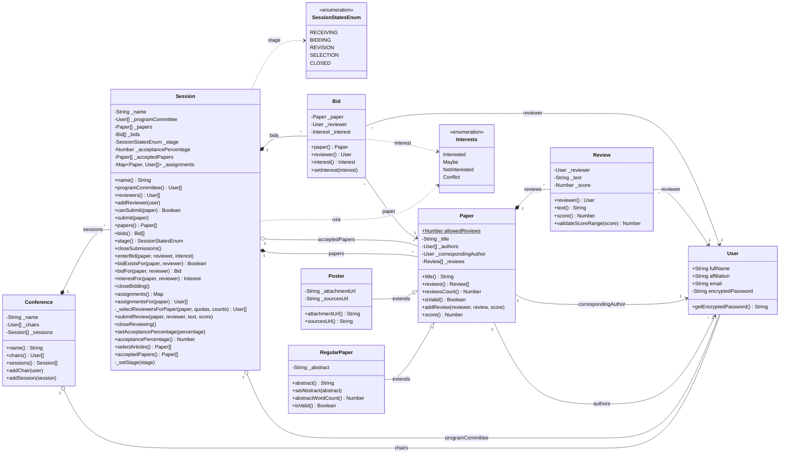

# Diagrama de clases — ComfyChair

Diagrama de clases que refleja la solución completa (código base + funcionalidad
implementada: asignación de revisores, carga de revisiones y selección de artículos).

## Notas

- **Herencia:** `RegularPaper` y `Poster` extienden `Paper`. `RegularPaper`
  sobrescribe `isValid()` para validar el límite de 300 palabras del abstract.
- **Asignación de revisores:** `Session` mantiene `_assignments` (un `Map` de
  `Paper → User[]`) que se completa en `closeBidding()` mediante el método
  privado `_selectReviewersForPaper()`, respetando el orden de prioridad de bids
  y excluyendo conflictos de interés (`Interests.Conflict`).
- **Carga de revisiones:** `submitReview()` valida que la sesión esté en etapa
  `REVISION`, que el revisor esté asignado al artículo, y delega en
  `Paper.addReview()` (que a su vez crea una `Review` y respeta el máximo de
  `Paper.allowedReviews = 3`).
- **Selección:** `selectArticles()` ordena los artículos por score decreciente y
  acepta hasta el `_acceptancePercentage` del total enviado.
- **Composición vs. agregación:** se modela como composición (`*--`) lo que la
  sesión/conferencia/artículo poseen y gestionan internamente (`Session→Paper`,
  `Session→Bid`, `Conference→Session`, `Paper→Review`); como agregación (`o--`)
  las referencias a `User`, que existen de forma independiente y pueden tener
  distintos roles en distintas conferencias.
