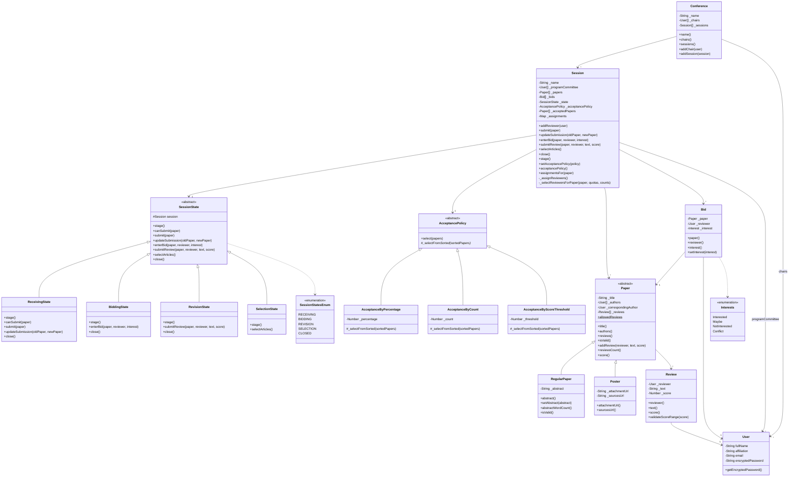

# Documentación de Diseño — ComfyChair

Este documento describe el diseño del sistema ComfyChair: el diagrama de clases actualizado a la entrega del TP2, los patrones de diseño aplicados y las decisiones de diseño y ambigüedades resueltas sobre los enunciados.

---

## 1. Diagrama de Clases

El siguiente diagrama refleja la solución completa (TP1 + TP2). Los nombres de atributos y métodos coinciden con el código (atributos privados con prefijo `_`, expuestos mediante *accessors*).

> Notación: `*` marca método abstracto (debe implementarse en subclases); `$` marca miembro estático (`Paper.allowedReviews`). `#` indica visibilidad protegida (convención: métodos `_`prefijados de uso interno por la jerarquía).

---

## 2. Patrones de Diseño Aplicados

### 2.1 State — Flujo de sesiones
El flujo de una sesión (Recepción → Bidding → Revisión → Selección) se modeló con el patrón **State**.

- **Contexto:** `Session` delega todo el comportamiento sensible a la etapa a su objeto `_state`. Los métodos públicos (`submit`, `enterBid`, `submitReview`, `selectArticles`, `close`, `updateSubmission`) son *thin delegations* hacia el estado actual.
- **Estados concretos:** `ReceivingState`, `BiddingState`, `RevisionState`, `SelectionState`, que extienden la clase base abstracta `SessionState`.
- **Operaciones habilitadas por etapa:** cada estado redefine *únicamente* las operaciones válidas en esa etapa. La base `SessionState` define todas las operaciones lanzando errores descriptivos por defecto, de modo que cualquier operación no habilitada en una etapa produce automáticamente un error sin condicionales.

| Etapa | Operaciones habilitadas |
|---|---|
| `ReceivingState` | `submit`, `updateSubmission`, `canSubmit`, `close` (→ Bidding) |
| `BiddingState` | `enterBid`, `close` (asigna revisores → Revisión) |
| `RevisionState` | `submitReview`, `close` (valida 3 reviews/paper → Selección) |
| `SelectionState` | `selectArticles` |

- **Extensibilidad (requisito TP2):** agregar una etapa futura consiste en crear una nueva subclase de `SessionState` y ajustar la transición `close()` del estado que la precede. No requiere tocar `Session` ni el resto de los estados, evitando la lógica condicional centralizada.

### 2.2 Strategy — Políticas de aceptación
La selección final de artículos se modeló con el patrón **Strategy**.

- **Contexto:** `Session` referencia una `AcceptancePolicy` intercambiable vía `setAcceptancePolicy(policy)`.
- **Estrategias concretas:**
  - `AcceptanceByPercentage(percentage)`: corte fijo por porcentaje sobre el total (comportamiento del TP1).
  - `AcceptanceByCount(count)`: acepta una cantidad máxima fija, en orden decreciente de score.
  - `AcceptanceByScoreThreshold(threshold)`: acepta todos los papers con score promedio ≥ umbral.
- **Beneficio:** `SelectionState` solo invoca `this.session.acceptancePolicy().select(papers)`, sin conocer la estrategia concreta. La política puede cambiarse independientemente del resto del sistema.

### 2.3 Template Method — Base de las políticas
`AcceptancePolicy` combina Strategy con **Template Method** para eliminar duplicación.

- `select(papers)` (método plantilla) ordena los papers por score descendente y delega en el *hook* abstracto `_selectFromSorted(sortedPapers)`.
- Cada estrategia concreta implementa solo `_selectFromSorted`, sin reimplementar el ordenamiento. Esto centraliza el criterio de orden y mantiene a las subclases enfocadas en su regla de corte.

---

## 3. Decisiones de Diseño y Ambigüedades Resueltas

### 3.1 Transiciones polimórficas con `close()`
Los métodos específicos por etapa (`closeSubmissions`, `closeBidding`, `closeReviewing`) se unificaron en un único `close()` polimórfico expuesto por `Session` y por cada estado. Cada estado conoce su sucesor lógico, eliminando acoplamiento temporal y condicionales en el cliente.

### 3.2 Desacoplamiento de las políticas
Se eliminaron métodos acoplados a tipos concretos (p. ej. `setAcceptancePercentage`). El cliente inyecta la estrategia mediante `setAcceptancePolicy(policy)`. La política por defecto de una sesión nueva es `AcceptanceByPercentage(0)` (no acepta papers hasta configurarse), preservando el comportamiento del TP1.

### 3.3 Compatibilidad hacia atrás (TP2)
El TP2 solicita `AcceptanceByCount` y `AcceptanceByScoreThreshold`, pero el corte por porcentaje del TP1 (`AcceptanceByPercentage`) se mantiene como una estrategia más, garantizando que el comportamiento existente y sus tests sigan funcionando sin cambios.

### 3.4 Conflicto de interés en la asignación
En `_assignReviewers` / `_selectReviewersForPaper` se excluye como revisor a quien sea autor del paper (`paper.authors().includes(reviewer)`) y a quien haya declarado interés `Conflict`. Además, solo los revisores asignados pueden cargar revisiones (`RevisionState.submitReview`). La asignación respeta el orden de prioridad `Interested → Maybe → sin bid → NotInterested` y la distribución equitativa de cuotas `⌈3A/R⌉` con reparto del resto.

### 3.5 Modificación de envíos en recepción
`updateSubmission(oldPaper, newPaper)` solo está habilitado en `ReceivingState`. Reemplaza la instancia previa por la nueva dentro del array de papers, validando el formato del nuevo envío (`isValid()`). Cumple "los envíos pueden modificarse hasta el cierre de la etapa".

### 3.6 Validación de revisiones
`Review` valida que el puntaje sea entero en el rango [−3, +3]. `Paper` limita a 3 revisiones (`Paper.allowedReviews`, atributo estático) y `RevisionState.close()` exige que todos los papers tengan exactamente 3 revisiones antes de pasar a Selección.

### 3.7 Límite del abstract (ambigüedad resuelta)
El enunciado dice "abstract de menos de 300 palabras". `RegularPaper.isValid()` lo implementa como **`abstractWordCount() <= 300`** (≤, no estrictamente <). Se documenta esta interpretación; si la cátedra exige `< 300`, es un cambio de un carácter en `RegularPaper.isValid()`.

### 3.8 Sin lambdas fuera de la API de colecciones
Todas las funciones anónimas / flecha del código aparecen exclusivamente dentro de la API de colecciones (`map`, `filter`, `reduce`, `forEach`, `sort`, `find`, `every`), conforme a la restricción del enunciado. La lógica de ordenamiento auxiliar (`byRemainingQuota`) se definió como función nombrada.

---

## 4. Refactorizaciones de limpieza (post-revisión)

- **`Session._setStage`:** se simplificó a un *setter* puro (`this._state = state`). El cambio de etapa del flujo normal lo gobierna `close()`, que pasa la instancia del próximo estado a `_setStage`. La rama anterior que construía estados a partir de un string del enum existía solo para conveniencia de los tests; se eliminó y los tests ahora construyen el estado directamente (p. ej. `new SelectionState(session)`), quitando esa lógica condicional del código de producción.
- **Etapa `CLOSED`:** se quitó del enum por no tener estado ni transición asociada. Cerrar formalmente la sesión tras la selección sería una nueva subclase de `SessionState` con transición desde `SelectionState.close()` — un buen ejemplo de la extensibilidad del patrón State si se requiere a futuro.
