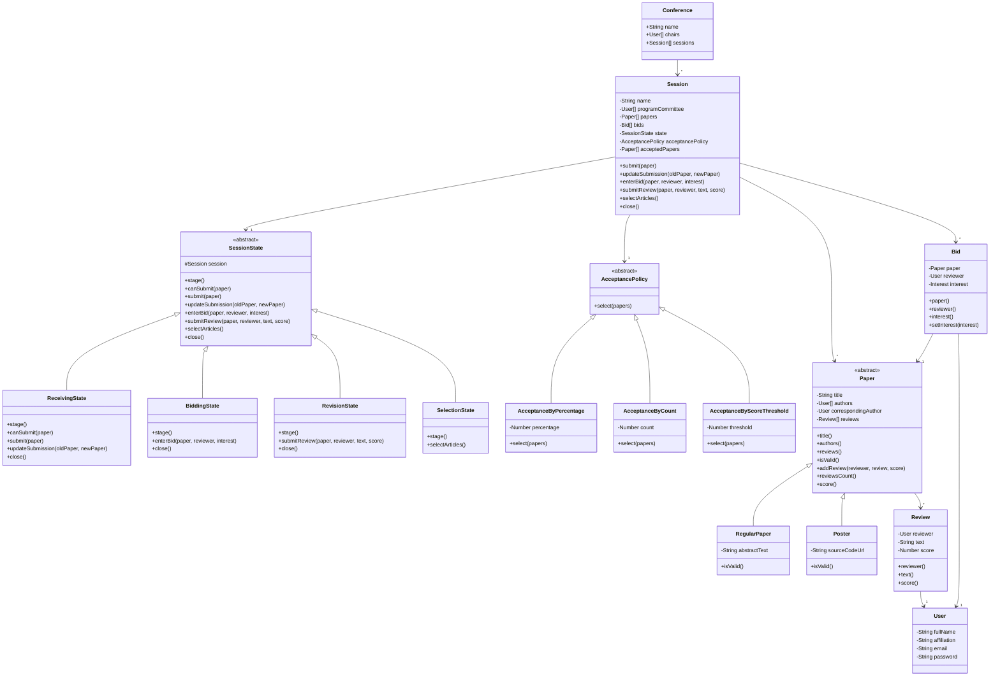

# Documentación de Diseño — ComfyChair

Este documento describe el diseño detallado del sistema ComfyChair, incluyendo el diagrama de clases, los patrones de diseño aplicados y las principales decisiones de diseño que dan soporte al flujo y reglas de negocio del sistema.

---

## 1. Diagrama de Clases

A continuación se muestra el diagrama de clases actualizado al estado de la entrega actual. Se detallan las relaciones entre conferencias, sesiones, estados del flujo, políticas de aceptación de artículos, y el modelo de dominio.

---

## 2. Patrones de Diseño Aplicados

### Patrón State
El flujo de una sesión (etapas de Recepción, Bidding, Revisión y Selección) se modeló mediante el patrón **State**. 
- **Contexto**: La clase `Session` delega todo el comportamiento sensible a la etapa actual a su objeto de estado interno `_state`.
- **Estados Concretos**: `ReceivingState`, `BiddingState`, `RevisionState` y `SelectionState` extienden a la clase base abstracta `SessionState`.
- **Beneficios**:
  - Evita el uso de condicionales complejos (`if/else` o `switch` sobre una variable de etapa) en cada método de negocio.
  - Cada estado define de manera estricta qué acciones están permitidas (por ejemplo, `submit` solo en `ReceivingState`, `enterBid` solo en `BiddingState`, y `submitReview` solo en `RevisionState`), lanzando excepciones descriptivas por defecto en la clase base para las operaciones no soportadas.

### Patrón Strategy
Para resolver la flexibilidad requerida en la selección final de artículos a ser aceptados, se aplicó el patrón **Strategy**.
- **Contexto**: La clase `Session` posee una referencia a una política de aceptación de tipo `AcceptancePolicy`.
- **Estrategias Concretas**: 
  - `AcceptanceByPercentage`: Selección por porcentaje de corte (porcentaje fijo sobre el total).
  - `AcceptanceByCount`: Acepta una cantidad fija de artículos.
  - `AcceptanceByScoreThreshold`: Acepta aquellos artículos con un score superior a un umbral determinado.
- **Beneficios**:
  - El algoritmo de selección queda completamente encapsulado fuera de la clase `Session` y fuera del estado `SelectionState`.
  - Permite configurar o cambiar dinámicamente la estrategia de aceptación de la sesión mediante `setAcceptancePolicy(policy)`.

---

## 3. Principales Decisiones de Diseño y Refactorizaciones

### 1. Polimorfismo en Transiciones de Etapas (`close()`)
Inicialmente, la transición manual entre etapas se realizaba mediante métodos con nombres específicos del estado (`closeSubmissions()`, `closeBidding()`, `closeReviewing()`). Esto generaba un acoplamiento temporal y rompía el principio de polimorfismo.
- **Decisión**: Se unificaron estos métodos en un único método polimórfico `close()` expuesto tanto en `Session` como en los estados concretos. Cada estado sabe exactamente cuál es su siguiente estado lógico al invocar `close()`.

### 2. Desacoplamiento de las Políticas de Aceptación
Para evitar la dependencia circular y el conocimiento explícito de la sesión sobre los tipos concretos de política:
- **Decisión**: Se removieron los métodos acoplados como `setAcceptancePercentage()` de `Session.js`. En su lugar, el cliente interactúa con la sesión a través de `setAcceptancePolicy(policy)` inyectando la estrategia deseada. `SelectionState` simplemente llama a `this.session.acceptancePolicy().select(this.session.papers())`, desacoplándose de cualquier tipo específico de política.

### 3. Conflicto de Interés: Exclusión de Autores
- **Decisión**: Para evitar que un autor actúe como revisor de su propio trabajo, en la asignación automática de revisores (`_assignReviewers` y `_selectReviewersForPaper` en `Session.js`), se verifica que el revisor no esté en la lista de autores (`paper.authors()`). Además, se restringe la carga de revisiones para que solo los revisores asignados a un paper puedan evaluarlo.

### 4. Modificación de Envíos en Recepción
- **Decisión**: Se agregó el método `updateSubmission(oldPaper, newPaper)` delegado a `SessionState` y soportado exclusivamente por `ReceivingState`. Si el autor desea modificar su envío, se reemplaza la instancia original por la nueva dentro del array de papers del contexto, asegurando que la nueva versión sea validada previamente (`newPaper.isValid()`) y que esta acción solo sea permitida antes del deadline (cierre de la etapa de recepción).
